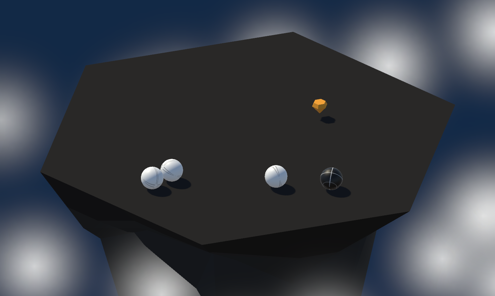

# Floating Island Sumo 🥋

## About the Game
**Floating Island Sumo** is a simple arcade-style **ball game** built in Unity. You control a ball on a floating island, battling waves of enemies. Knock opponents off the arena and survive as long as possible, using power-ups to gain the upper hand!

---

## Features
- Fast-paced **arcade-style ball gameplay**
- **Increasingly challenging** enemy waves
- **Power-ups** for a temporary advantage
- Simple, fun, and addictive mechanics

---

## How to Play
1. **Move:** Use **WASD** keys to navigate your ball.
2. **Objective:** Push all enemies off the island.
3. **Use Power-ups:** Collect items to boost your strength temporarily.
4. **Survive:** Each wave gets harder—don’t fall!
